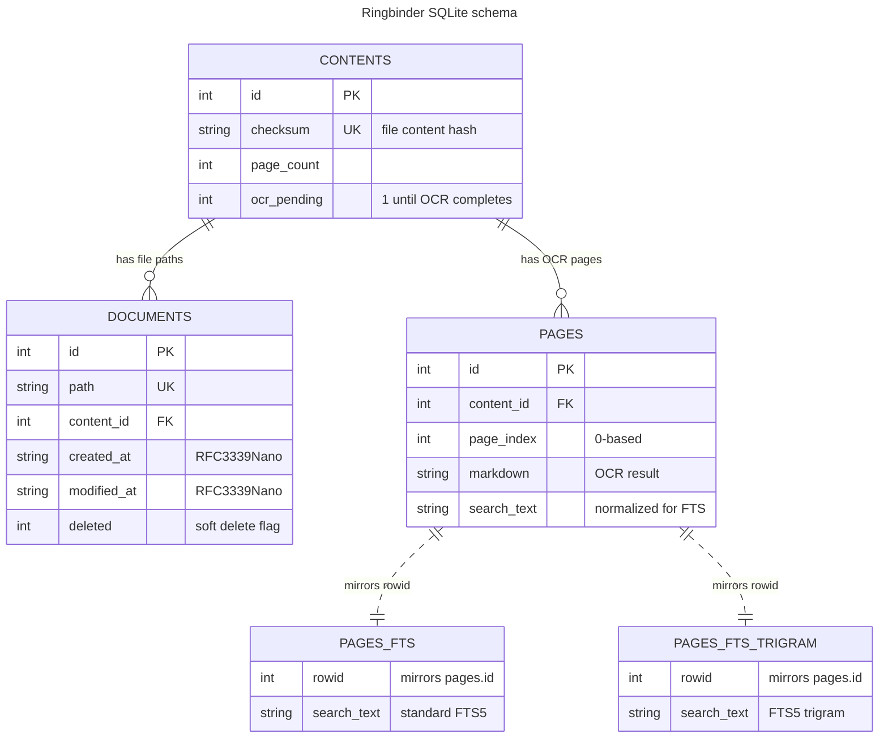

# Ringbinder

Ringbinder is a small CLI tool that keeps a single SQLite file of PDFs and images that you have scattered around your filesystem. It doesn't touch, change, or ingest any of the files, only records their paths. With that, it provides convenient methods to OCR them, and search them. You can then query the db using a few methods provided by ringbinder itself, or just point any other sqlite client at it.

When using OCR, it just populates text in an associated db column, it doesn't inject the text back into the pdf files or anything like that.

For OCR, it integrates with Mistral's API, because I tried it, and it does a good job of recognizing text and describing graphs and images for an acceptable (to me) price. So I can easily find all drawings of dragons that my kids made, for example.

My use case is just scanning every piece of paper I come across (as well as immediately shredding most of them): physical mail, manuals, official documents, downloaded pdfs and images, my kids' schoolwork and drawings. I use an old ScanSnap S1500M that still works great for >15 years, and my iPhone's camera + a shortcut that scans into an iCloud-synced dir. Later I can find anything by having AI agents query the db for me. The other day I found who installed my house sump pump backup system (it was hand-written on a random page of an old disclosure doc).

## Features

- Indexes PDF, PNG, JPEG, and JPG files
- Runs OCR through the Mistral OCR API
- Stores OCR text locally as per-page Markdown
- Searches with SQLite FTS5, including an optional trigram index for OCR-noisy matches
- Falls back to path matches when the text index does not find anything
- Reads exact pages, page ranges, or neighboring context pages
- Emits JSON/NDJSON for scripts, tools, and agents
- De-duplicates identical file contents by checksum
- Tracks deleted, restored, changed, and unchanged files during incremental sweeps

## Install

Ringbinder is a Go CLI. It currently targets macOS and Linux.

```sh
go install github.com/maxim/ringbinder@latest
```

Or build it from a clone:

```sh
git clone https://github.com/maxim/ringbinder.git
cd ringbinder
go build -o ringbinder .
```

You will also need a Mistral API key for OCR:

```sh
export MISTRAL_API_KEY="..."
```

## Quick start

Create a config file with the paths you want Ringbinder to watch:

```sh
mkdir -p ~/.config/ringbinder
cat > ~/.config/ringbinder/config.yml <<'YAML'
paths:
  - ~/Documents
  - ~/Downloads/**/*.pdf
YAML
```

Then run the usual loop:

```sh
# Scan configured paths and add new/changed files to the local database.
ringbinder sweep

# Check the OCR cost for all pending docs before sending them to Mistral.
ringbinder cost

# OCR all pending documents.
ringbinder ocr

# Search the OCR text.
ringbinder find "property tax" --verbose

# Read a page from a result. Page flags are 0-based.
ringbinder read --path "/Users/you/Documents/taxes/assessment.pdf" --page 0 --context 1
```

The database lives at `~/.config/ringbinder/ringbinder.db`.

## Database structure

Ringbinder keeps the schema intentionally small. `documents` is the filesystem view, `contents` is the de-duplicated file identity, `pages` is OCR output, and the FTS tables are SQLite virtual indexes fed by triggers on `pages`.



A few details:

- `documents.content_id` points at `contents.id`; multiple paths can share one content row when files are byte-identical.
- `pages.content_id` points at `contents.id` with `ON DELETE CASCADE`, so OCR pages are removed when orphaned content is cleaned up.
- `pages` is unique by `(content_id, page_index)`, which lets OCR upserts replace page text in place.
- `pages_fts` and `pages_fts_trigram` are external-content FTS5 indexes over `pages.search_text`, maintained by the `pages_ai`, `pages_ad`, and `pages_au` triggers.
- Most reads, searches, and listings filter out rows where `documents.deleted = 1`; those soft-deleted paths let future sweeps restore the same row if the file comes back.

## Configuration

By default Ringbinder reads:

```text
~/.config/ringbinder/config.yml
```

The config is intentionally small:

```yaml
paths:
  - ~/Documents
  - ~/Downloads/**/*.pdf
  - /Volumes/Archive/scans
```

You can also pass paths directly:

```sh
ringbinder sweep ~/Documents ~/Desktop/inbox
```

Use `--config` to point at a different config file:

```sh
ringbinder --config ./ringbinder.yml sweep
```

Globs are supported, including `**`. During a sweep you can exclude individual files or glob patterns:

```sh
ringbinder sweep ~/Documents --exclude "**/private/*.pdf" --exclude "draft-scan.pdf"
```

## Commands

### `sweep`

Scans paths for supported files and updates the local document index.

```sh
ringbinder sweep [paths...]
```

Useful flags:

- `--exclude <pattern>` skips matching files
- `-j, --concurrency <n>` controls scan workers
- `--redo` deletes existing document/OCR data after confirmation and starts over

### `cost`

Estimates the Mistral OCR cost for pending documents.

```sh
ringbinder cost
ringbinder cost --redo
```

The estimate uses the price baked into the current build. Check Mistral's pricing before a large run.

### `ocr`

Runs OCR on pending content and stores extracted Markdown locally.

```sh
ringbinder ocr
ringbinder ocr --redo
ringbinder ocr --concurrency 2
```

`ocr` requires `MISTRAL_API_KEY`. Files larger than 200 MB are skipped by the OCR client.

### `find`

Searches OCR text and document paths.

```sh
ringbinder find "insurance claim"
ringbinder find "insurance claim" --verbose
ringbinder find "insurance claim" --mode or
ringbinder find "insur claim" --trigram
ringbinder find --fts '"insurance" AND "claim"'
```

Useful flags:

- `--mode and|or` controls how normal query tokens are combined
- `--fts <query>` sends a raw SQLite FTS5 query
- `--trigram` also checks the trigram index for noisy or partial matches
- `--limit` and `--offset` paginate results
- `--json` emits NDJSON records

### `read`

Reads full OCR Markdown for a document page or page range.

```sh
ringbinder read --path "/path/to/file.pdf" --page 3
ringbinder read --path "/path/to/file.pdf" --page 3 --context 1
ringbinder read --path "/path/to/file.pdf" --start 0 --end 4
ringbinder read --path "/path/to/file.pdf" --page 3 --json
```

Page flags are 0-based. Human-readable output displays pages as 1-based.

### `doc`

Lists indexed documents or fetches metadata for one document.

```sh
ringbinder doc list
ringbinder doc list --after 2026-01-01 --before 2026-02-01
ringbinder doc list --json
ringbinder doc get --path "/path/to/file.pdf"
ringbinder doc get --path "/path/to/file.pdf" --json
```

## Automation

Use `--json` on supported commands when you want stable machine-readable output:

```sh
ringbinder find --json --limit 10 "lease renewal"
ringbinder read --json --path "/path/to/lease.pdf" --page 2 --context 1
ringbinder doc list --json --limit 100
```

`find` and `doc list` emit NDJSON, one object per line. `read` and `doc get` emit a single JSON object.

The included `SKILL.md` is an example agent skill that explains how to use Ringbinder for cited document retrieval.

## Privacy and storage

Ringbinder keeps its index and OCR text in a local SQLite database under `~/.config/ringbinder/`.

OCR is the one networked step: `ringbinder ocr` sends each pending document or image to the Mistral OCR API. If that is not acceptable for a folder, do not include that folder in your config.

## Development

```sh
go test ./...
go build -o ringbinder .
```

Project layout:

```text
cmd/        CLI commands
internal/   scanner, database, OCR, formatting, and support packages
main.go     entry point
```

## License

Ringbinder is released under the MIT License. See [LICENSE](LICENSE).
