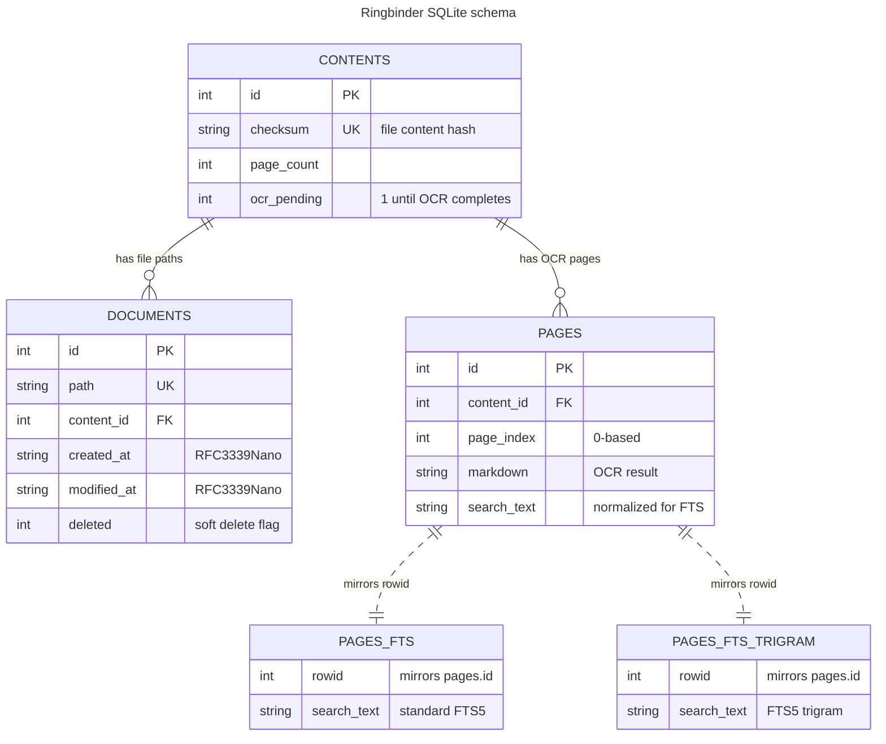

# Ringbinder

Ringbinder is a small CLI tool that keeps a single SQLite file of PDFs and images that you have scattered around your filesystem. It doesn't touch, change, or ingest any of the files, only records their paths. With that, it provides convenient methods to OCR them, and search them. You can then query the db using a few methods provided by ringbinder itself, or just point any other sqlite client at it.

When using OCR, it just populates text in an associated db column, it doesn't inject the text back into the pdf files or anything like that.

For OCR, it integrates with Mistral by default and offers Gemini as an opt-in provider. Both transcribe text and describe visual elements for search, so I can easily find all drawings of dragons that my kids made, for example.

My use case is just scanning every piece of paper I come across (as well as immediately shredding most of them): physical mail, manuals, official documents, downloaded pdfs and images, my kids' schoolwork and drawings. I use an old ScanSnap S1500M that still works great for >15 years, and my iPhone's camera + a shortcut that scans into an iCloud-synced dir. Later I can find anything by having AI agents query the db for me. The other day I found who installed my house sump pump backup system (it was hand-written on a random page of an old disclosure doc).

## Features

- Indexes PDF, PNG, JPEG, and JPG files
- Runs OCR through the Mistral or Gemini API
- Stores OCR text locally as per-page Markdown
- Searches with SQLite FTS5, including an optional trigram index for OCR-noisy matches
- Falls back to path matches when the text index does not find anything
- Reads exact pages, page ranges, or neighboring context pages
- Emits JSON/NDJSON for scripts, tools, and agents
- De-duplicates identical file contents by checksum
- Tracks deleted, restored, changed, and unchanged files during incremental sweeps

## Install

Ringbinder currently targets macOS and Linux. Install it with Homebrew, which compiles the pinned release source using Go as a build-only dependency:

```sh
brew install maxim/tap/ringbinder
```

### Developer alternatives

With a Go toolchain installed, you can install the latest source directly:

```sh
go install github.com/maxim/ringbinder@latest
```

Or build it from a clone:

```sh
git clone https://github.com/maxim/ringbinder.git
cd ringbinder
go build -o ringbinder .
```

OCR requires the key for the provider you select. Mistral is the default:

```sh
export MISTRAL_API_KEY="..."
# Or, when using --model gemini or model: gemini:
export GEMINI_API_KEY="..."
```

## Quick start

Create a config file with the paths you want Ringbinder to watch:

```sh
mkdir -p ~/.config/ringbinder
cat > ~/.config/ringbinder/config.yml <<'YAML'
paths:
  - ~/Documents
  - ~/Downloads/**/*.pdf
YAML
```

Then run the usual loop:

```sh
# Scan configured paths and add new/changed files to the local database.
ringbinder sweep

# Check the OCR cost for all pending content before sending anything.
ringbinder cost

# OCR all pending documents.
ringbinder ocr

# Search the OCR text.
ringbinder find "property tax" --verbose

# Read a page from a result. Page flags are 0-based.
ringbinder read --path "/Users/you/Documents/taxes/assessment.pdf" --page 0 --context 1
```

By default, the database lives at `~/.config/ringbinder/ringbinder.db`. You can override it with `database_path` in config or the global `--database` flag.

## Database structure

Ringbinder keeps the schema intentionally small. `documents` is the filesystem view, `contents` is the de-duplicated file identity, `pages` is OCR output, and the FTS tables are SQLite virtual indexes fed by triggers on `pages`.


```mermaid
---
title: Ringbinder SQLite schema
---
erDiagram
    CONTENTS ||--o{ DOCUMENTS : "has file paths"
    CONTENTS ||--o{ PAGES : "has OCR pages"
    PAGES ||..|| PAGES_FTS : "mirrors rowid"
    PAGES ||..|| PAGES_FTS_TRIGRAM : "mirrors rowid"

    CONTENTS {
        int id PK
        string checksum UK "file content hash"
        int page_count
        int ocr_pending "1 until OCR completes"
    }

    DOCUMENTS {
        int id PK
        string path UK
        int content_id FK
        string created_at "RFC3339Nano"
        string modified_at "RFC3339Nano"
        int deleted "soft delete flag"
    }

    PAGES {
        int id PK
        int content_id FK
        int page_index "0-based"
        string markdown "OCR result"
        string search_text "normalized for FTS"
    }

    PAGES_FTS {
        int rowid "mirrors pages.id"
        string search_text "standard FTS5"
    }

    PAGES_FTS_TRIGRAM {
        int rowid "mirrors pages.id"
        string search_text "FTS5 trigram"
    }
```

A few details:

- `documents.content_id` points at `contents.id`; multiple paths can share one content row when files are byte-identical.
- `pages.content_id` points at `contents.id` with `ON DELETE CASCADE`, so OCR pages are removed when orphaned content is cleaned up.
- `pages` is unique by `(content_id, page_index)`, which lets OCR upserts replace page text in place.
- `pages_fts` and `pages_fts_trigram` are external-content FTS5 indexes over `pages.search_text`, maintained by the `pages_ai`, `pages_ad`, and `pages_au` triggers.
- Most reads, searches, and listings filter out rows where `documents.deleted = 1`; those soft-deleted paths let future sweeps restore the same row if the file comes back.

## Configuration

By default Ringbinder reads:

```text
~/.config/ringbinder/config.yml
```

The config is intentionally small:

```yaml
paths:
  - ~/Documents
  - ~/Downloads/**/*.pdf
  - /Volumes/Archive/scans

# Optional OCR settings:
model: gemini
ocr_concurrency: 20
```

`model` accepts exactly `mistral` or `gemini` and defaults to `mistral`. `ocr_concurrency` applies only to OCR. Its provider default is 4 for Mistral and 20 for Gemini; `ocr --concurrency` overrides it.

Optionally, set a custom SQLite database file path:

```yaml
database_path: ~/.local/share/ringbinder/ringbinder.db
paths:
  - ~/Documents
```

`database_path` is a file path, not a directory. If omitted, Ringbinder uses `~/.config/ringbinder/ringbinder.db`.

You can also pass paths directly:

```sh
ringbinder sweep ~/Documents ~/Desktop/inbox
```

Use `--config` to point at a different config file:

```sh
ringbinder --config ./ringbinder.yml sweep
```

Use `--database` to point at a different SQLite database file for any command. The flag overrides `database_path` from config:

```sh
ringbinder --database ./ringbinder.db find "property tax"
```

Globs are supported, including `**`. During a sweep you can exclude individual files or glob patterns:

```sh
ringbinder sweep ~/Documents --exclude "**/private/*.pdf" --exclude "draft-scan.pdf"
```

## Commands

### `sweep`

Scans paths for supported files and updates the local document index.

```sh
ringbinder sweep [paths...]
```

Useful flags:

- `--exclude <pattern>` skips matching files
- `-j, --concurrency <n>` controls scan workers

### `cost`

Estimates the selected provider's OCR cost for unique pending content. It is offline and does not require an API key or upload files.

```sh
ringbinder cost
ringbinder cost --model gemini
ringbinder cost --limit 100
```

`--limit <n>` estimates only the next `n` unique pending content items in stable order. When it truncates the backlog, the output shows the selected batch size and total pending count; page and price totals cover only that batch. The limit is CLI-only and must be at least 1 when supplied.

Mistral estimates are exact at the baked-in annotated-page price of `$0.0050/page` because Ringbinder requests image and graphic descriptions for search. Gemini estimates are visibly approximate: they assume about 560 medium-resolution input tokens per PDF page, 1,120 high-resolution input tokens per standalone image, 1,200 output-and-thinking tokens per page, and 250 input tokens of prompt/schema overhead per image request or planned 20-page PDF chunk. The baked-in standard paid Gemini rates are `$0.75/$3.75` per million input/output tokens through December 31, 2026 and `$1.50/$7.50` starting January 1, 2027 UTC. Actual generated length, byte-driven chunks, and retries can vary.

### `ocr`

Runs OCR on pending content and stores extracted Markdown locally.

```sh
ringbinder ocr
ringbinder ocr --model gemini
ringbinder ocr --limit 100
ringbinder ocr --concurrency 2
```

`--model` overrides the configured provider. OCR requires only that provider's key (`MISTRAL_API_KEY` or `GEMINI_API_KEY`) and never falls back to the other provider. `--concurrency/-j` overrides `ocr_concurrency` and the provider default. `--limit <n>` attempts only the next `n` unique pending content items in stable order; failed items remain pending, and the limit caps attempts rather than successful results. The limit is CLI-only and must be at least 1 when supplied. Large PDFs are chunked internally to fit API limits; Ringbinder does not split or modify your document files.

After attempting content, Ringbinder prints one actual cost total based on provider-reported usage. If usage is incomplete or a request outcome is ambiguous, it prints the known cost and warns that the actual cost may be higher.

### `find`

Searches OCR text and document paths.

```sh
ringbinder find "insurance claim"
ringbinder find "insurance claim" --verbose
ringbinder find "insurance claim" --mode or
ringbinder find "insur claim" --trigram
ringbinder find --fts '"insurance" AND "claim"'
```

Useful flags:

- `--mode and|or` controls how normal query tokens are combined
- `--fts <query>` sends a raw SQLite FTS5 query
- `--trigram` also checks the trigram index for noisy or partial matches
- `--limit` and `--offset` paginate results
- `--json` emits NDJSON records

### `read`

Reads full OCR Markdown for a document page or page range.

```sh
ringbinder read --path "/path/to/file.pdf" --page 3
ringbinder read --path "/path/to/file.pdf" --page 3 --context 1
ringbinder read --path "/path/to/file.pdf" --start 0 --end 4
ringbinder read --path "/path/to/file.pdf" --page 3 --json
```

Page flags are 0-based. Human-readable output displays pages as 1-based.

### `doc`

Lists indexed documents or fetches metadata for one document.

```sh
ringbinder doc list
ringbinder doc list --after 2026-01-01 --before 2026-02-01
ringbinder doc list --json
ringbinder doc get --path "/path/to/file.pdf"
ringbinder doc get --path "/path/to/file.pdf" --json
```

## Rebuilding OCR with another model

Build a second database instead of replacing OCR in the active database. The existing database remains searchable throughout the rebuild.

```sh
new_db="$HOME/.config/ringbinder/ringbinder-new.db"

# Index the configured paths into a separate database.
ringbinder --database "$new_db" sweep

# Review and run one bounded batch with the target provider.
ringbinder --database "$new_db" cost --model gemini --limit 100
ringbinder --database "$new_db" ocr --model gemini --limit 100

# If the sample looks good, estimate and process the remaining backlog.
ringbinder --database "$new_db" cost --model gemini
ringbinder --database "$new_db" ocr --model gemini
```

Check the first batch's OCR results before continuing. If they look good, the unbounded `cost` and `ocr` commands estimate and process everything still pending. Then run one final `sweep` against the new database and use the same unbounded commands to drain any newly pending items.

After verifying searches against `--database "$new_db"`, update `database_path` in the config to point to the new file.

## Automation

Use `--json` on supported commands when you want stable machine-readable output:

```sh
ringbinder find --json --limit 10 "lease renewal"
ringbinder read --json --path "/path/to/lease.pdf" --page 2 --context 1
ringbinder doc list --json --limit 100
```

`find` and `doc list` emit NDJSON, one object per line. `read` and `doc get` emit a single JSON object.

The included `SKILL.md` is an example agent skill that explains how to use Ringbinder for cited document retrieval.

## Privacy and storage

Ringbinder keeps its index and OCR text in a local SQLite database. By default it uses `~/.config/ringbinder/ringbinder.db`; set `database_path` or pass `--database` to use a different file.

OCR is the one networked step: `ringbinder ocr` sends each pending document or image to the selected Mistral or Gemini API. `ringbinder cost` remains local and offline. If uploading a folder's documents to the selected provider is not acceptable, do not include that folder in your config.

## Development

```sh
go test ./...
go build -o ringbinder .
```

Project layout:

```text
cmd/        CLI commands
internal/   scanner, database, OCR, formatting, and support packages
main.go     entry point
```

## License

Ringbinder is released under the MIT License. See [LICENSE](LICENSE).
